# DeepMetaHandles (CVPR2021 Oral)

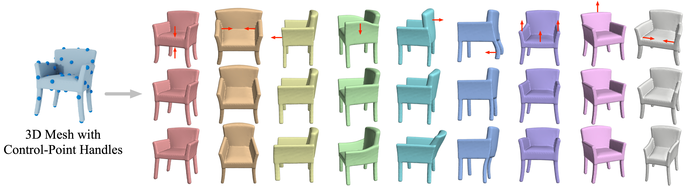 
<div float="center">
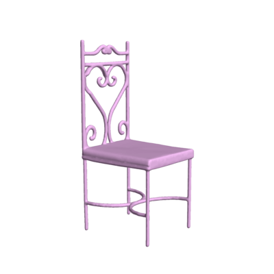
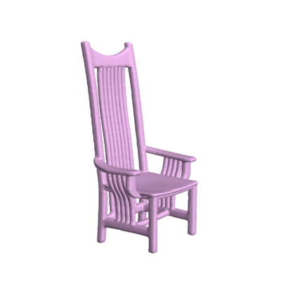
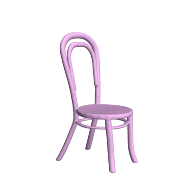
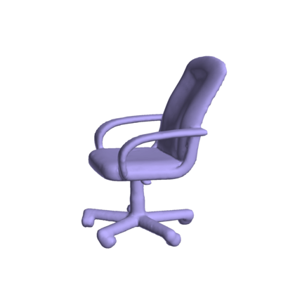
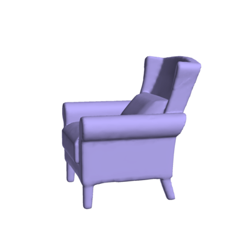
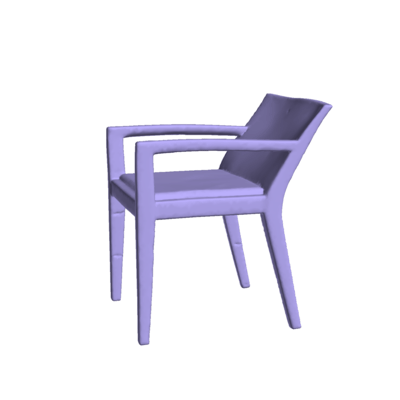
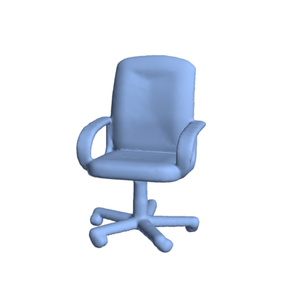
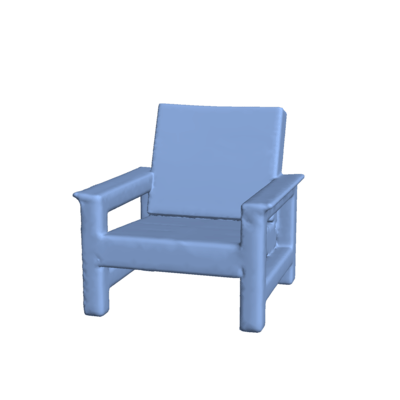
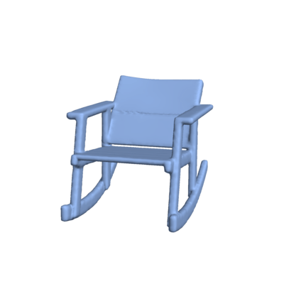  
</div>
<div float="center">
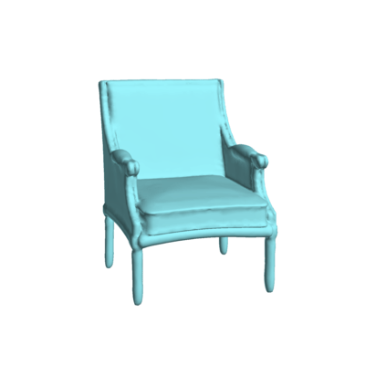
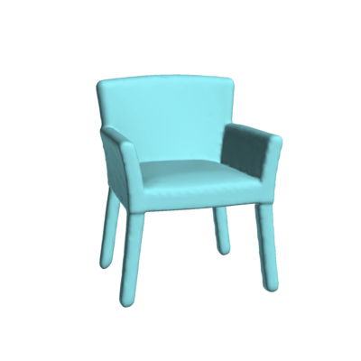
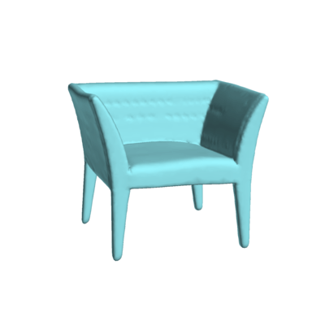
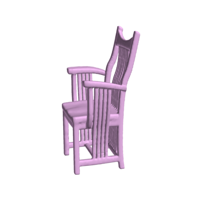
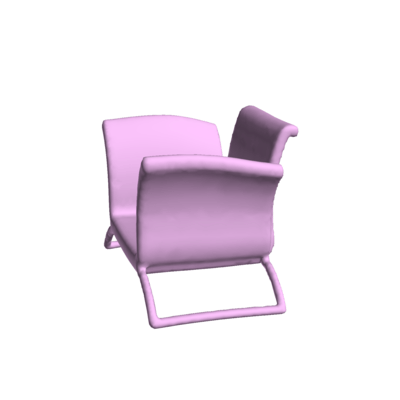
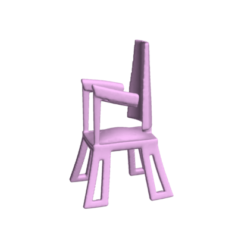
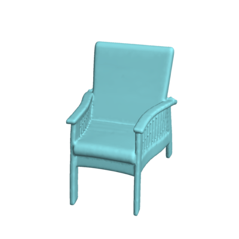
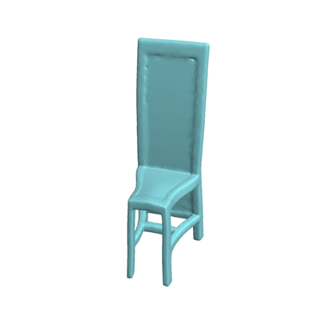
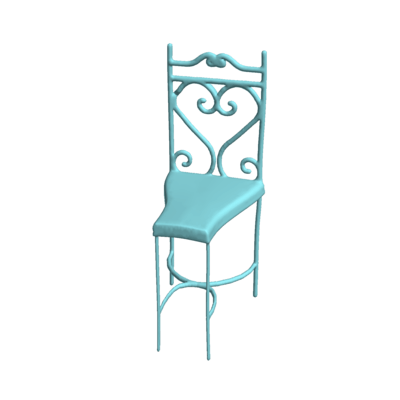
</div>

 [[project]](https://mhsung.github.io/papers/deep-meta-handles.html) [[paper]](https://arxiv.org/pdf/2102.09105) [[demo]](https://mhsung.github.io/deep-meta-handles-demo/web_demo.html) [[animations]](http://cseweb.ucsd.edu/~mil070/deep_meta_handles_supp_animations)  

DeepMetaHandles is a shape deformation technique. It learns a set of meta-handles for each given shape. The disentangled meta-handles factorize all the plausible deformations of the shape, while each of them corresponds to an intuitive deformation direction. A new deformation can then be generated by the "linear combination" of the meta-handles. Although the approach is learned in an unsupervised manner, the learned meta-handles possess strong interpretability and consistency.

## Environment setup

1. Create a conda environment by `conda env create -f environment.yml`.
2. Build and install [torch-batch-svd](https://github.com/KinglittleQ/torch-batch-svd).

## Demo

1. Download `data/demo` and `checkpoints/chair_15.pth` from [here](https://drive.google.com/drive/folders/1vYfcSJlVE9Hgh3nGlvGvg_GSFToVZH39?usp=sharing) and place them in the corresponding folder. Pre-processed demo data contains the manifold mesh, sampled control point, sampled surface point cloud, and corresponding biharmonic coordinates.
2. Run `src/demo_target_driven_deform.py` to deform a source shape to match a target shape.
3. Run `src/demo_meta_handle.py` to generate deformations along the direction of each learned meta-handle.

## Train
1. Download `data/chair` from [here](https://drive.google.com/drive/folders/1vYfcSJlVE9Hgh3nGlvGvg_GSFToVZH39?usp=sharing) and place them in the corresponding folder.
2. Run the visdom server. (We use [visdom](https://github.com/fossasia/visdom)  to visualize the training process.)
3. Run `src/train.py` to start training.

Note: For different categories, you may need to adjust the number of meta-handles. Also, you need to tune the weights for the loss functions. Different sets of weights may produce significantly different results.

## Pre-process your own data

0. Compile codes in `data_preprocessing/.`
1. Build and run [manifold](https://github.com/hjwdzh/Manifold) to convert your meshes into watertight manifolds.
2. Run `data_preprocessing/normalize_bin` to normalize the manifold into a unit bounding sphere.
3. Build and run [fTetWild](https://github.com/wildmeshing/fTetWild) to convert your manifolds into tetrahedral meshes. Please use `--output xxx.mesh` option to generate the `.mesh` format tet mesh. Also, you will get a `xxx.mesh__sf.obj` for the surface mesh. We will use `xxx.mesh` and `xxx.mesh__sf.obj` to calculate the biharmonic weights. We will only deform `xxx.mesh__sf.obj` later.
4. Run `data_preprocessing/sample_key_points_bin` to sample control points from `xxx.mesh__sf.obj`. We use the FPS algorithm over edge distances to sample the control points.
5. Run `data_preprocessing/calc_weight_bin` to calculate the bihrnomic weights. It takes `xxx.mesh`, `xxx.mesh__sf.obj`, and the control point file as input, and will output a text file containing the weight matrix for the vertices in `xxx.mesh__sf.obj`.
6. Run `data_preprocessing/sample_surface_points_bin` to sample points on the `xxx.mesh__sf.obj` and calculate the corresponding biharmonic weights for the sampled point cloud.
7. In our training, we remove those shapes (about 10%) whose biharmonic weight matrix contains elements that are smaller than -1.5 or greater than 1.5. We find that this can help us to converge faster.
8. To reduce IO time during training, you may compress the data into a compact form and load them to the memory. For example, you can use python scripts in `data_preprocessing/merge_data` to convert cpp output into numpy files.


## Citation

If you find our work useful, please consider citing our paper:

```
@article{liu2021deepmetahandles,
  title={DeepMetaHandles: Learning Deformation Meta-Handles of 3D Meshes with Biharmonic Coordinates},
  author={Liu, Minghua and Sung, Minhyuk and Mech, Radomir and Su, Hao},
  journal={arXiv preprint arXiv:2102.09105},
  year={2021}
}
```


