# DeepMetaHandles

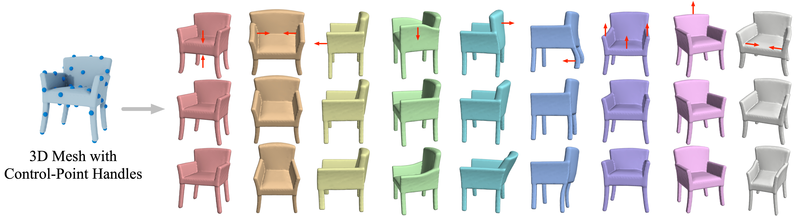 

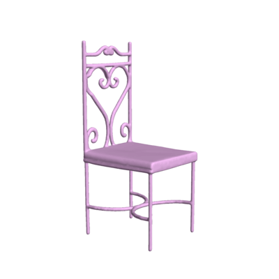
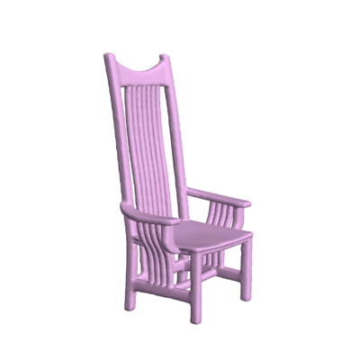
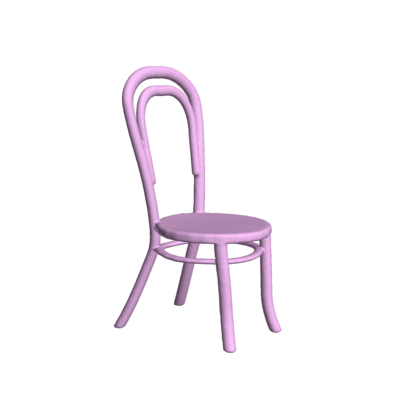
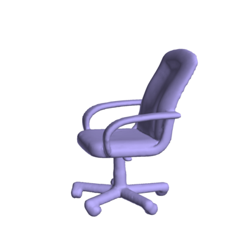
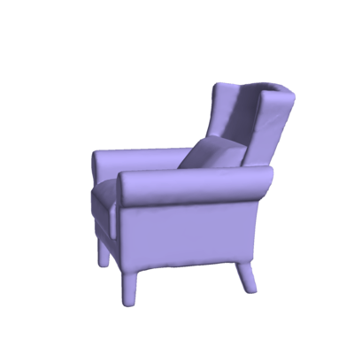
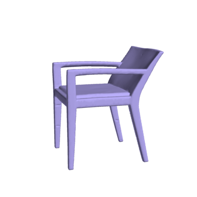
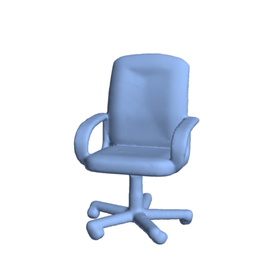
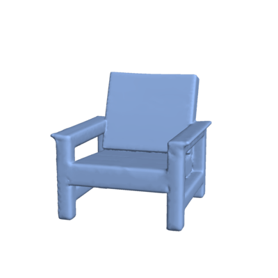
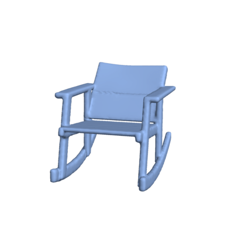  

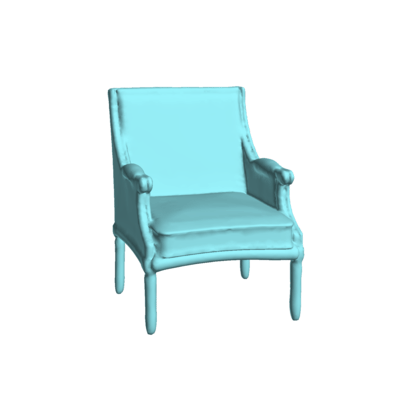
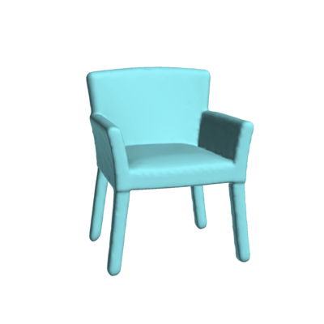
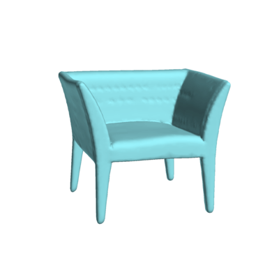
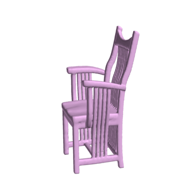
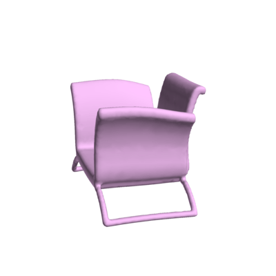
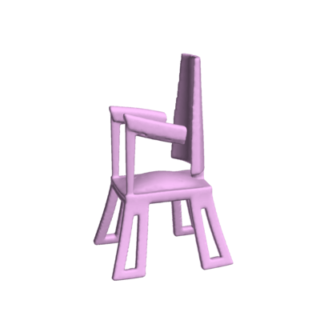
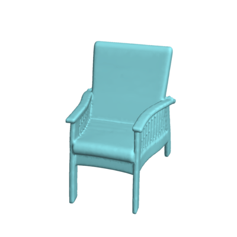
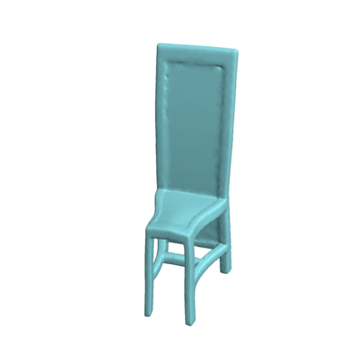
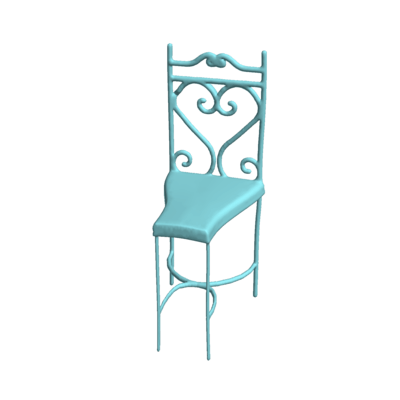

[[paper]](http://cseweb.ucsd.edu/~mil070/projects/CVPR2021/paper.pdf) [[animations]](http://cseweb.ucsd.edu/~mil070/deep_meta_handles_supp_animations)  

DeepMetaHandles is a shape deformation technique. It learns a set of meta-handles for each given shape. The disentangled meta-handles factorize all the plausible deformations of the shape, while each of them corresponds to an intuitive deformation direction. A new deformation can then be generated by the "linear combination" of the meta-handles. Although the approach is learned in an unsupervised manner, the learned meta-handles possess strong interpretability and consistency.

**Code is coming. Stay tuned!**
